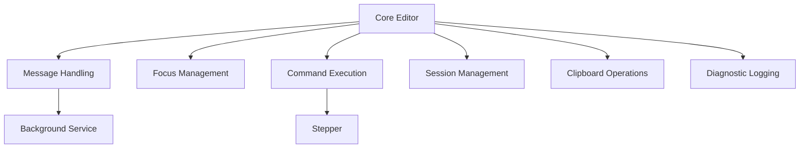

# Yeshie Extension Feature Analysis

## Feature Inventory

| Feature Name | Location | Dependencies | Status | Description | Removal Impact |
|--------------|----------|--------------|---------|-------------|----------------|
| Core Editor | extension/components/YeshieEditor.tsx | React, Plasmo | Active | Main editor component with message handling | Critical - Core functionality |
| Message Handling | extension/background/index.ts | Background Service Worker | Active | Handles message passing between content and background | Critical - Core communication |
| Diagnostic Logging | extension/functions/DiagnosticLogger | - | Active | Debug logging system with keyboard shortcuts | Optional - Development tool |
| Clipboard Operations | extension/components/YeshieEditor.tsx | Clipboard API | Active | Clipboard read/write functionality | Optional - UX enhancement |
| Focus Management | extension/components/YeshieEditor.tsx | DOM APIs | Active | Complex focus handling for editor | Critical - Core UX |
| Command Execution | extension/components/YeshieEditor.tsx | Stepper | Active | Command execution system | Critical - Core functionality |
| Session Management | extension/components/YeshieEditor.tsx | Background Service | Active | Session handling for conversations | Critical - Core functionality |

## Feature Dependencies Graph

## Removal Plan

### Priority Order
1. Diagnostic Logging (if not needed in production)
2. Clipboard Operations (if not critical)
3. Complex Focus Management (if can be simplified)

### Dependencies to Handle
- Ensure core editor functionality remains intact
- Maintain message passing system
- Preserve session management
- Keep command execution system

### Testing Requirements
- Test editor functionality after each removal
- Verify message passing still works
- Check session management
- Validate command execution
- Test focus behavior

### Rollback Plan
- Keep removed code in version control
- Document removed features
- Create feature flags if needed
- Maintain separate branches for feature removal

## Notes
- Last updated: 2024-03-21
- Status: In Progress
- Next Steps: 
  1. Review feature list with team
  2. Prioritize removals
  3. Create detailed removal plan for each feature
  4. Implement removals one at a time
  5. Test after each removal 